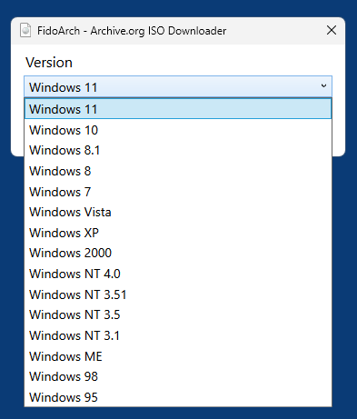
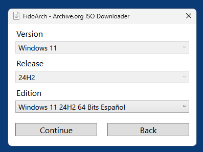
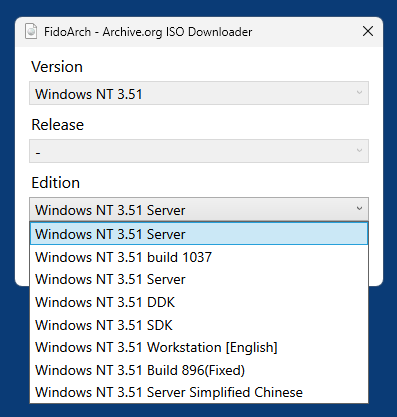

# FidoArch
A PowerShell script to download Windows ISOs from archive.org.

[FidoArch](https://raw.githubusercontent.com/59de44955ebd/FidoArch/refs/heads/main/FidoArch.ps1) is a modified clone of [Fido](https://github.com/pbatard/Fido) (also integrated into [Rufus](https://github.com/pbatard/rufus)) that allows to select and download Windows OS setup ISOs from [archive.org](https://archive.org/). 

Since it doesn't depend on MS servers, it also allows to download ISOs for various legacy systems (see first screenshot below).

It's basically a fun project, but maybe still useful.

## Screenshots
  
  

